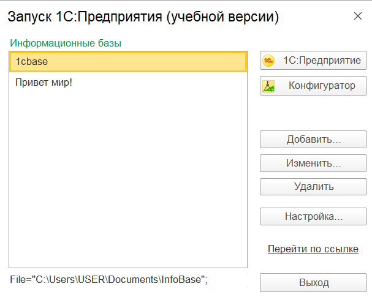
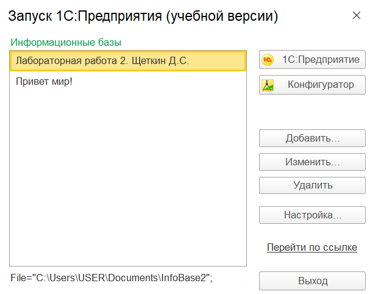

# Щеткин Дмитрий ИВТ 2.1
[Сборник лабораторных работ для студентов учебных заведений, изучающих программирование в системе 1С:Предприятие 8](https://its.1c.ru/db/publab82021)

- [x] 1 - 2
- 3 - 20

## Лабораторная работа № 1 УСТАНОВКА СИСТЕМЫ 1С:ПРЕДПРИЯТИЕ 8

## Лабораторная работа № 2 ОСНОВНЫЕ ПРИНЦИПЫ РАБОТЫ С ПЛАТФОРМОЙ

## Лабораторная работа № 3 РАЗРАБОТКА КОНФИГУРАЦИИ ДЛЯ ОРГАНИЗАЦИИ ХРАНЕНИЯ ИНФОРМАЦИИ О СТУДЕНТАХ И ИЗУЧАЕМЫХ ИМИ ПРЕДМЕТАХ

