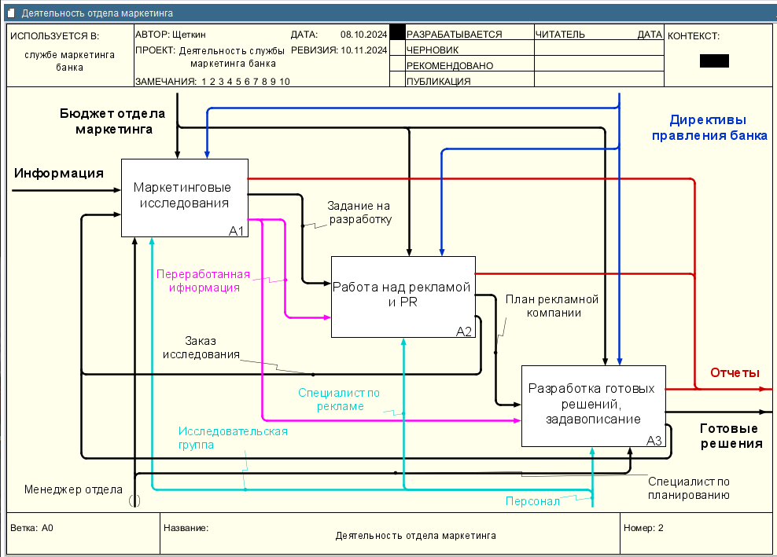

# Щеткин Дмитрий ИВТ 2.1
# Бизнес информатика КР 1. Методология SADT

[Контрольная работа 1, часть 1 – Щеткин](kr1.rsf)
[Контрольная работа 1, часть 2 – Щеткин](kr1.2.rsf)
## Часть 1

- 1 - 3:

- 4:

- 5:

- 6:

- 7:

## Часть 2

- 1 - 2:

- 3:

- 4 - 5:

