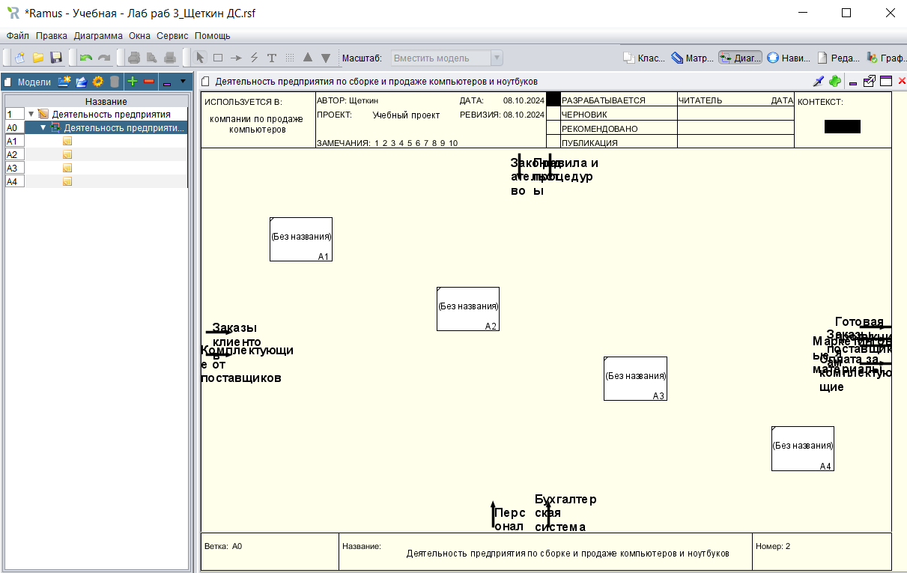
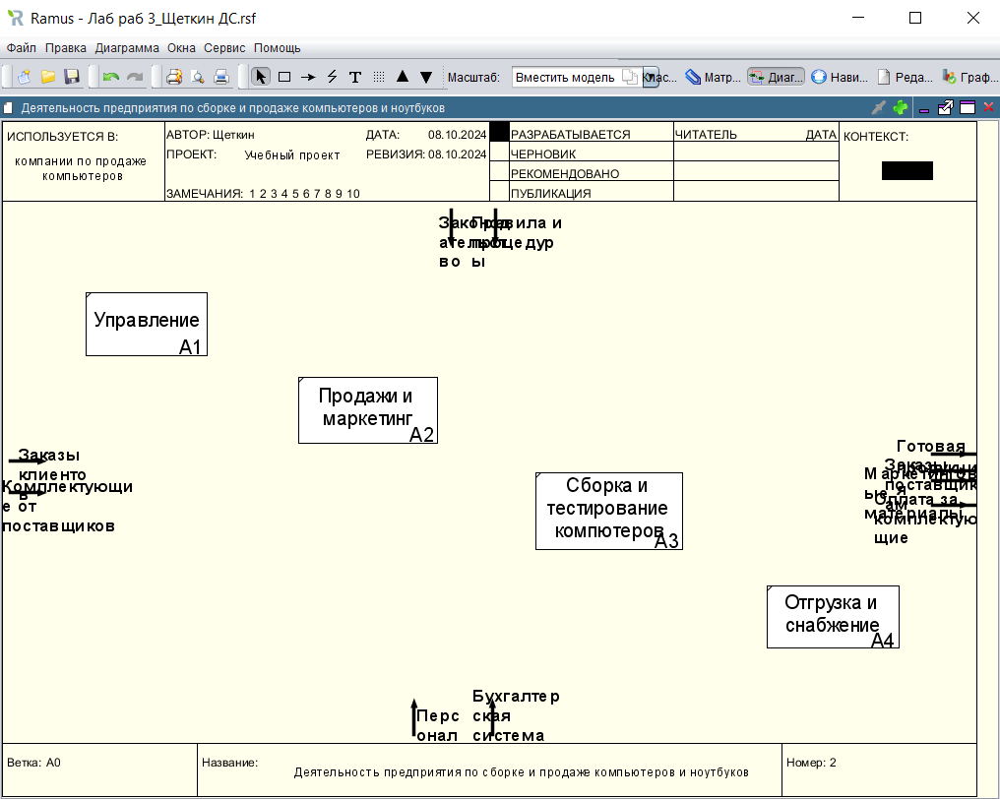
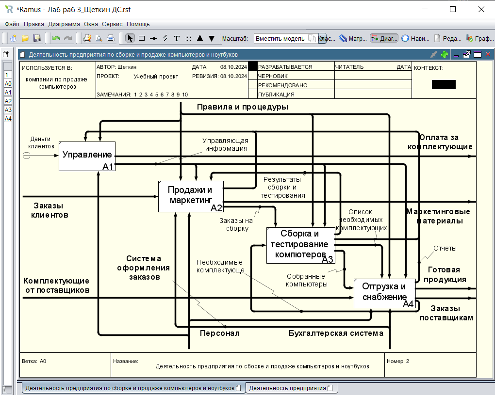
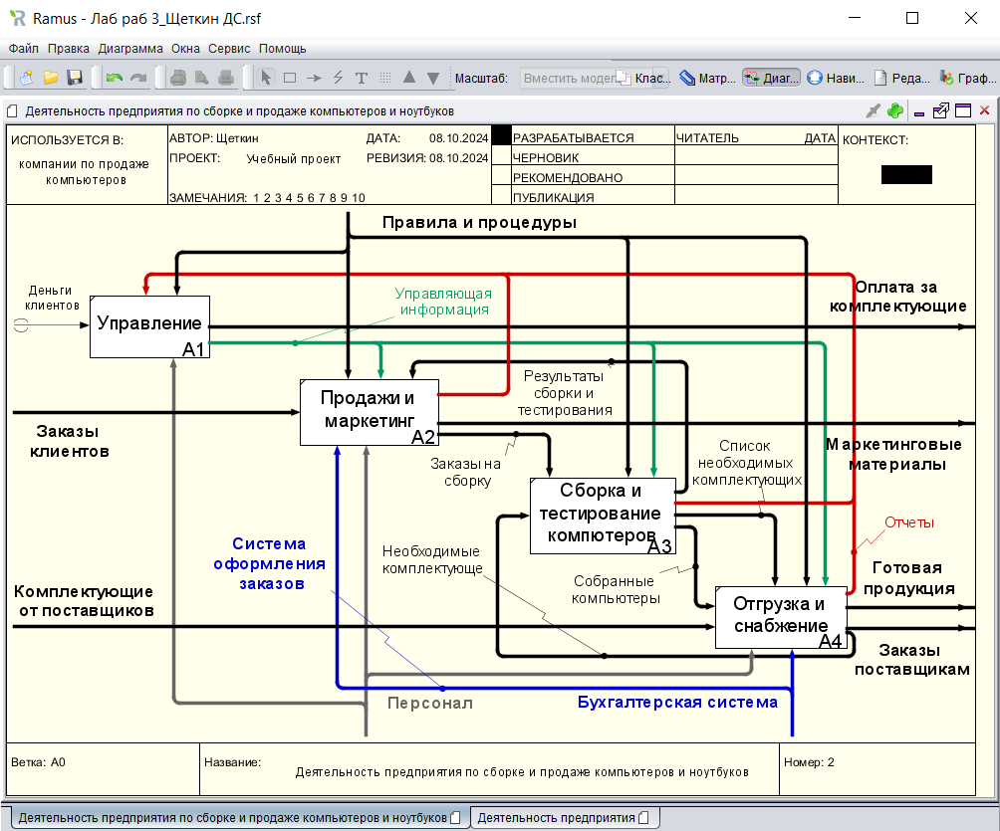

# Щеткин Дмитрий ИВТ 2.1
# Бизнес информатика ЛР 3. Создание диаграммы декомпозиции в нотации IDEF0 в программе Ramus Educational

[Лаб раб 3_Щеткин ДС](lab3.rsf)

- 1 - 2.2:

- 2.3 - 2.14:

- 2.15 - 2.47:

- 2.48 - 4:

