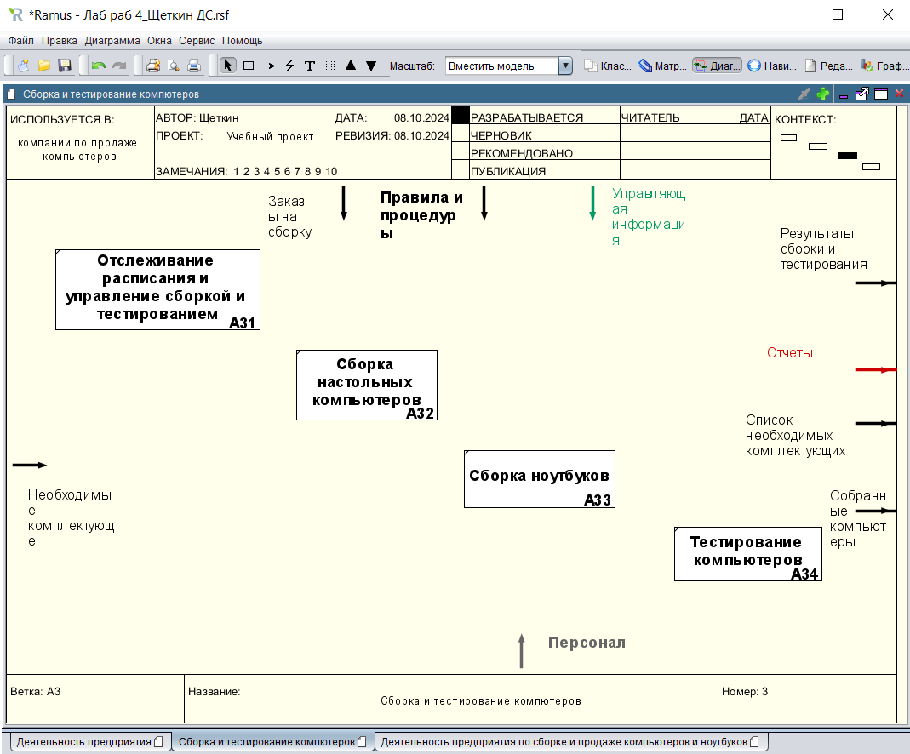
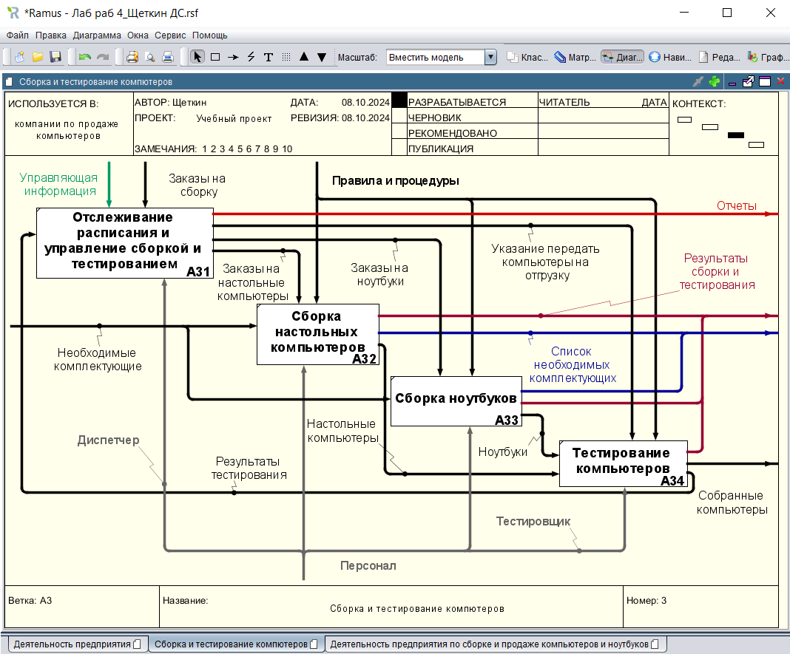
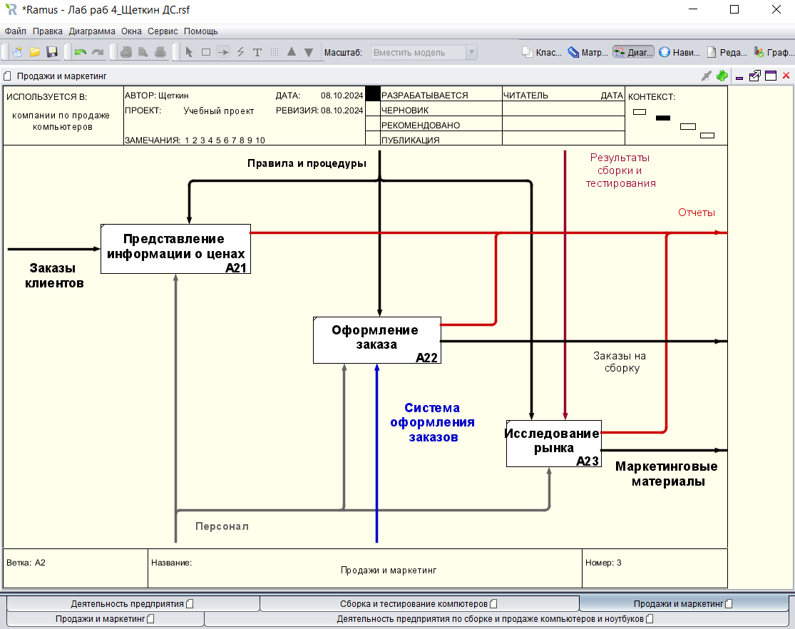
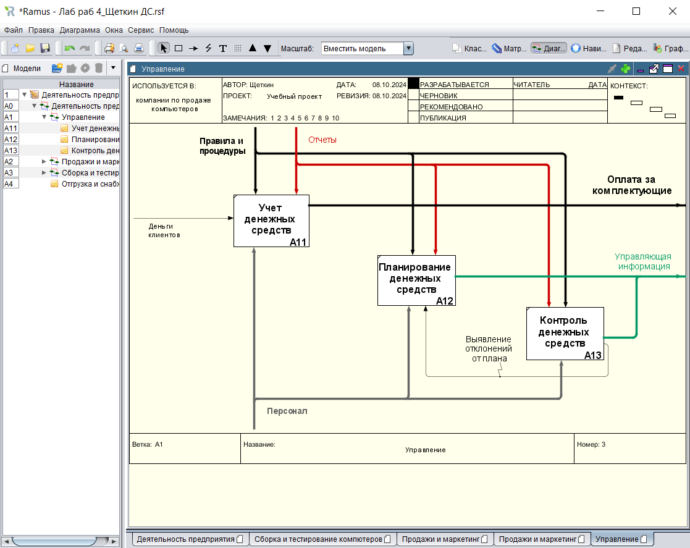
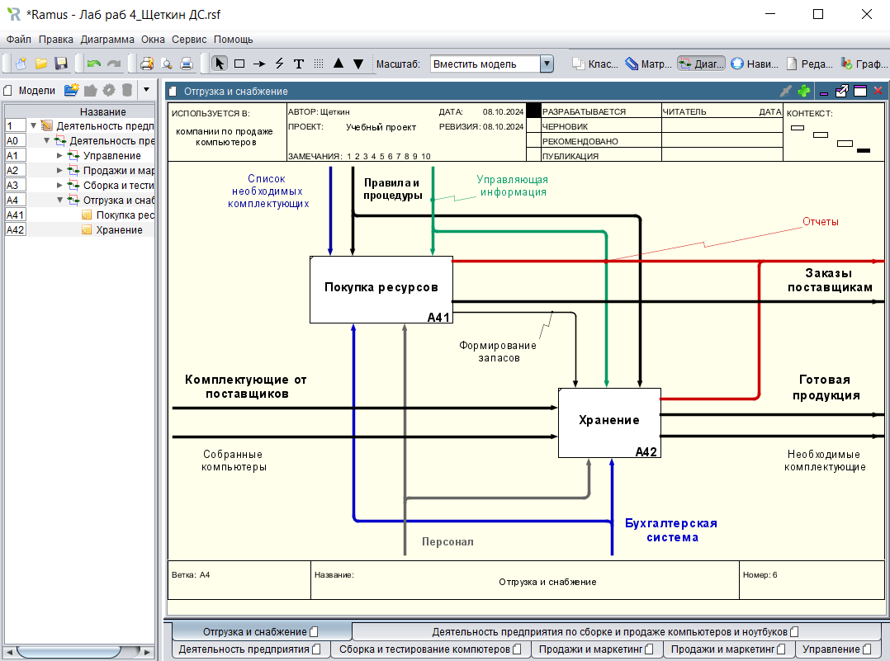

# Щеткин Дмитрий ИВТ 2.1
# Бизнес информатика ЛР 4. Создание диаграмм декомпозиции следующего уровня в нотации IDEF0 в программе Ramus Educational

[Лаб раб 4_Щеткин ДС](lab4.rsf)

- 1 - 2.10:

- 2.11 - 3:

- 4 - 5:

- 6 - 7:

- 8 - 10:

