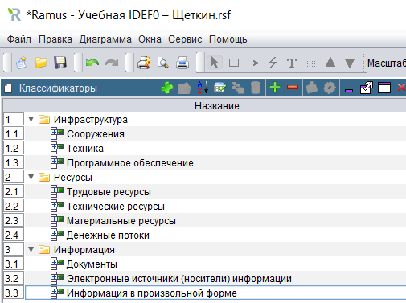
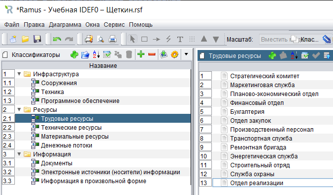
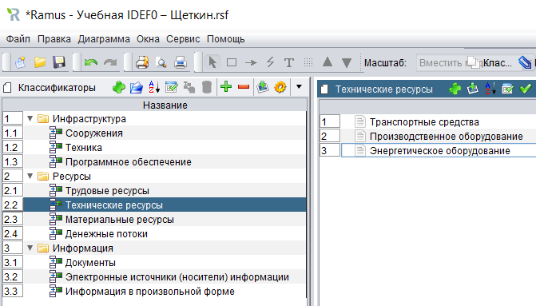
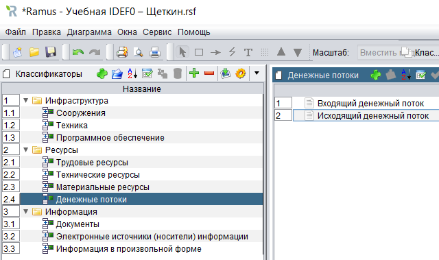
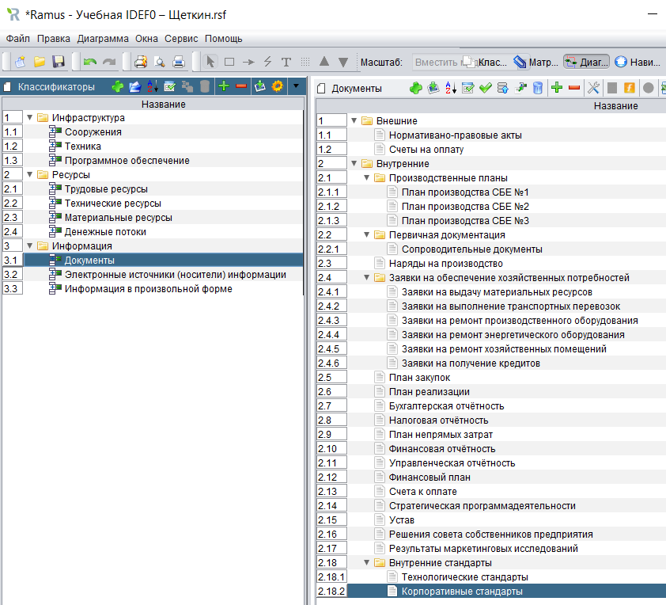
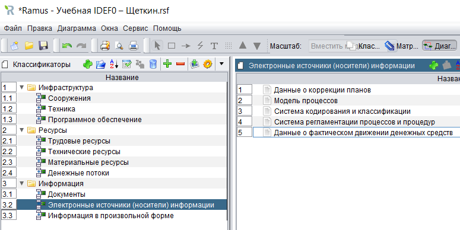
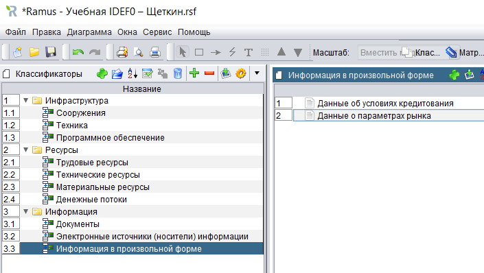

# Щеткин Дмитрий ИВТ 2.1
# Бизнес информатика ЛР 5.1. Создание классификаторов в программе Ramus Educational

[Учебная IDEF0 – Щеткин](lab5.1.rsf)

- 1 - 23:

- 31 - 32:

- 33:

- 34:

- 35-36:

- 37:

- 38-40:

