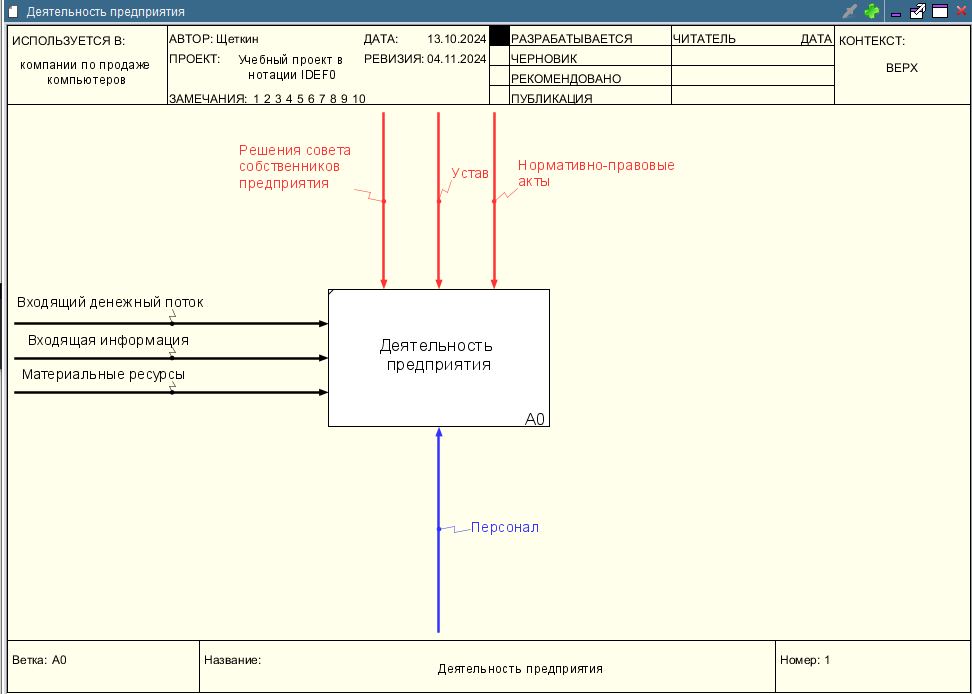

# Щеткин Дмитрий ИВТ 2.1
# Бизнес информатика ЛР 5.2. Создание контекстной диаграммы в нотации IDEF0 с использованием классификаторов в программе Ramus Educational

[Учебная IDEF0 – Щеткин](lab5.2.rsf)

- 1 - 20:

- 21 - 33:

