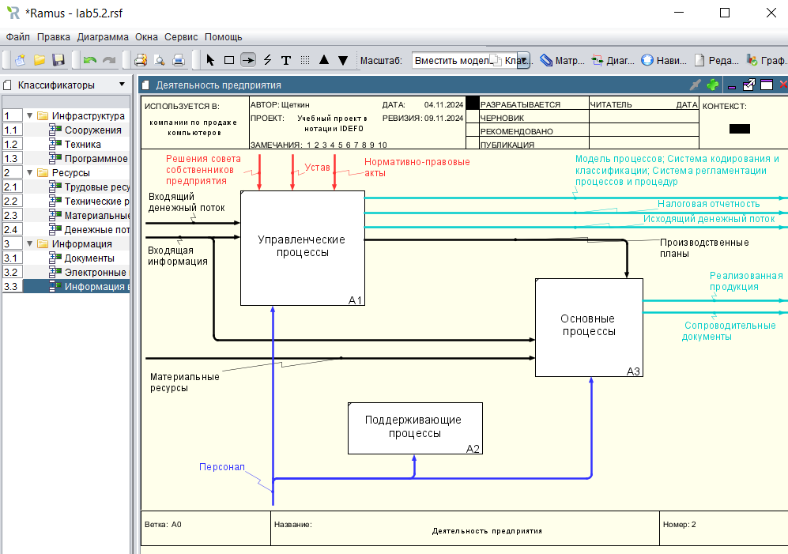
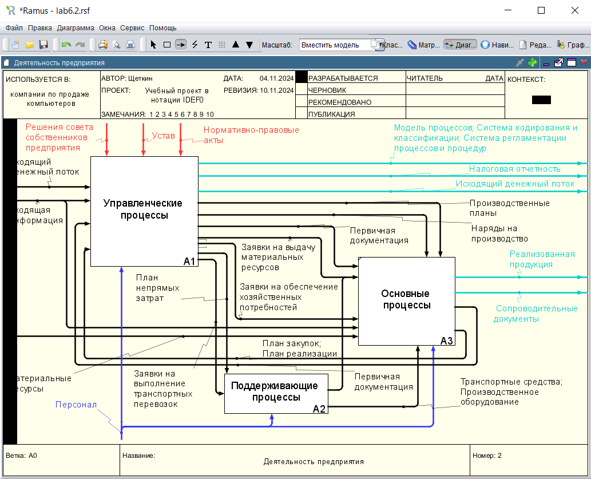

# Щеткин Дмитрий ИВТ 2.1
# Бизнес информатика ЛР 6.1. Создание диаграмм декомпозиции в нотации IDEF0 с использованием классификаторов в программе Ramus Educational

[ Учебная IDEF0 – Лаб раб 6 Щеткин](lab6.1.rsf)

- 1 - 3:

- 4 - 14:

