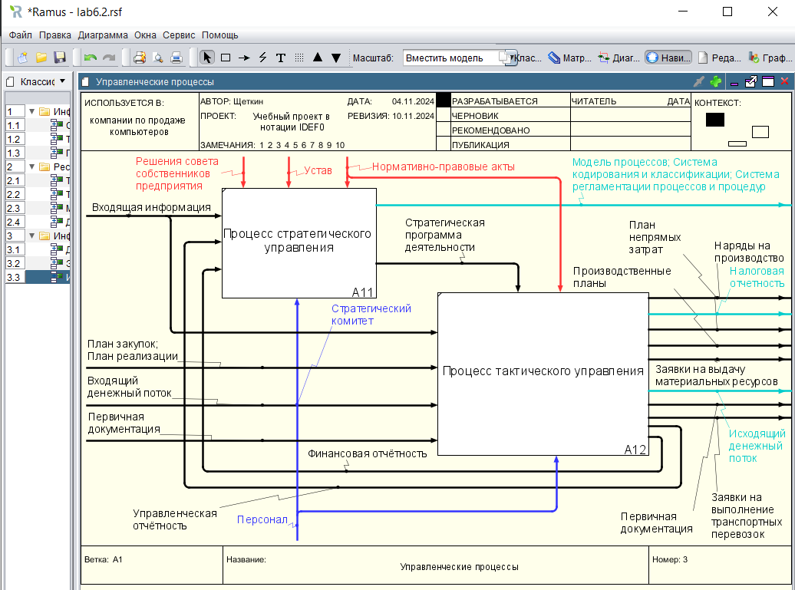
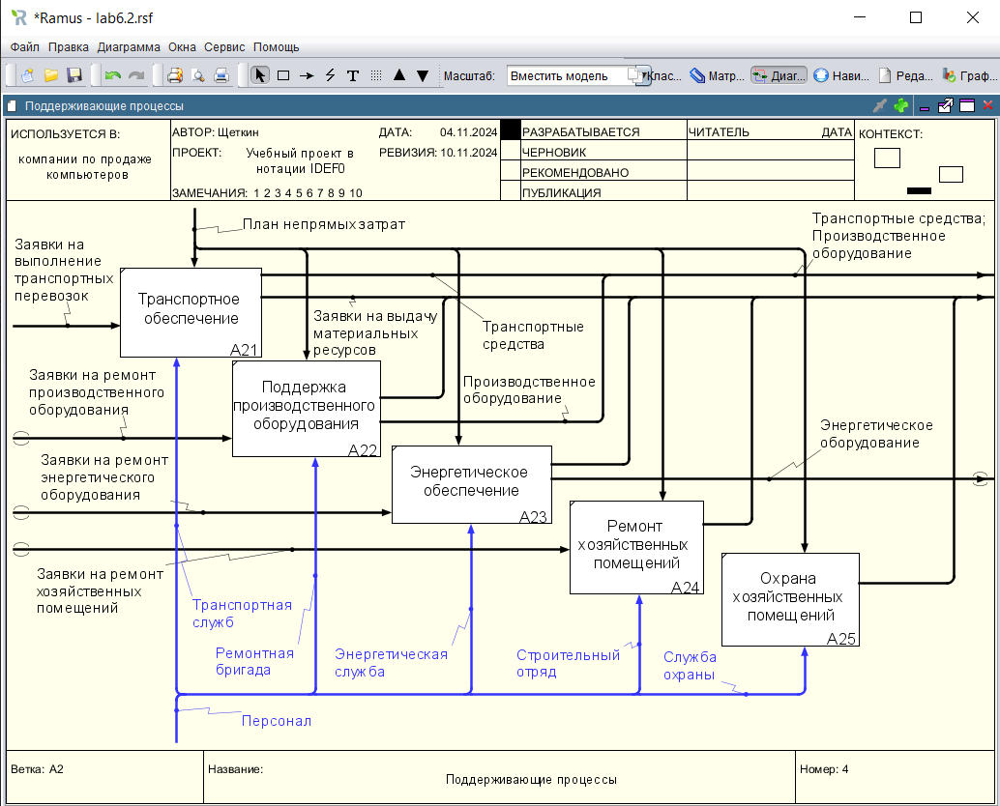
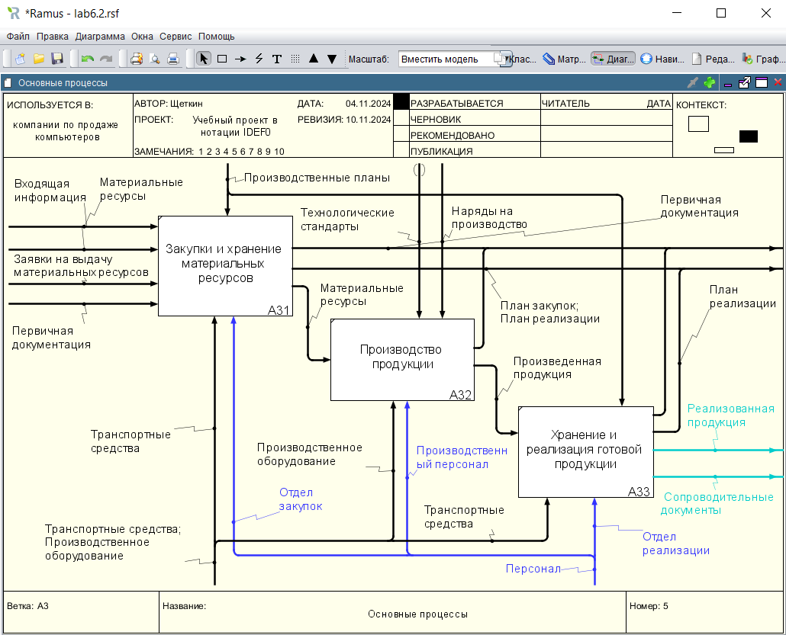
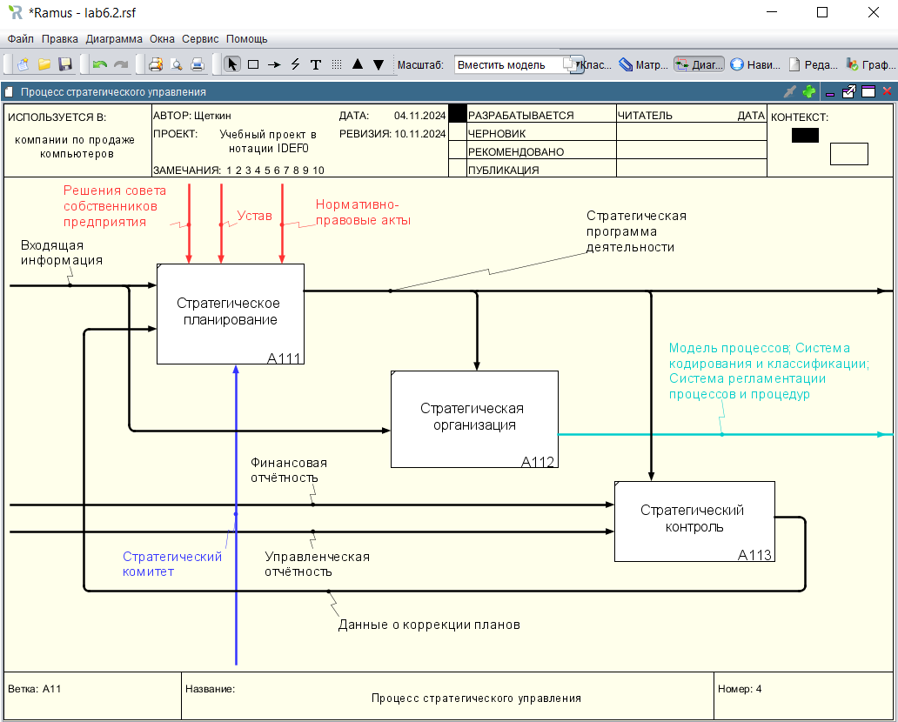
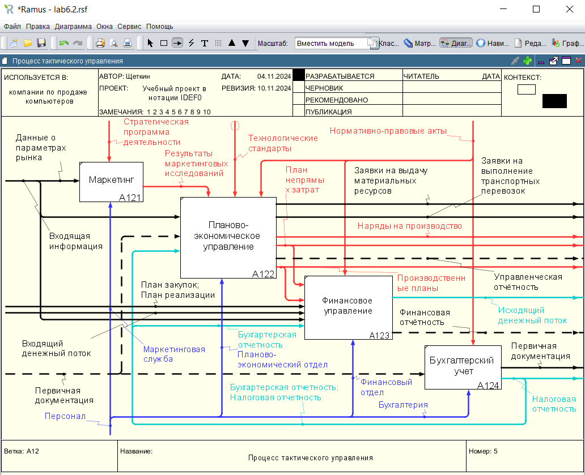

# Щеткин Дмитрий ИВТ 2.1
# Бизнес информатика ЛР 6.2. Создание диаграмм декомпозицииследующих уровней в нотации IDEF0 с использованием классификаторов в Ramus Educationa

[Учебная IDEF0 – Лаб раб 6 Щеткин](lab6.2.rsf)

- 1 - 2:

- 3:

- 4:

- 5:

- 6 - 7:

