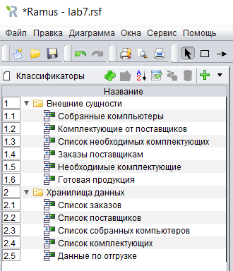
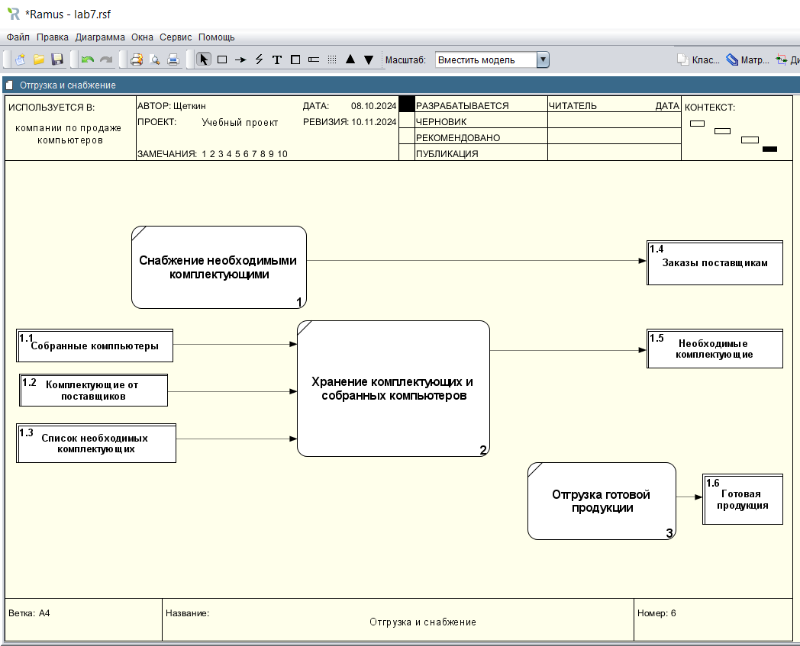
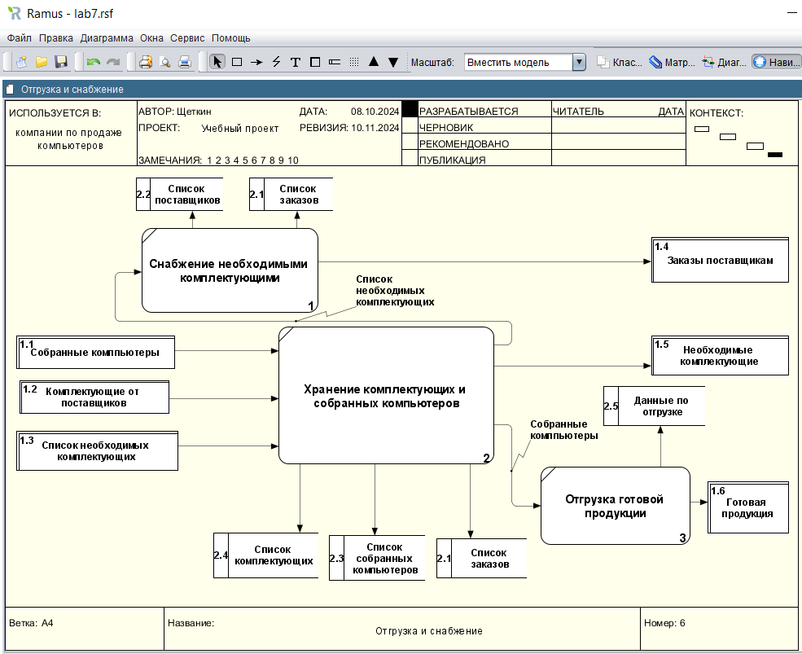
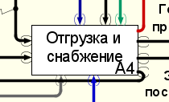

# Щеткин Дмитрий ИВТ 2.1
# Бизнес информатика ЛР 7. Создание диаграммы в нотации DFD в Ramus Educational

[Учебная DFD – Лаб.раб 7 Щеткин](lab7.rsf)

- 1 - 3:

- 4.1 - 4.14:

- 4.15 - 4.22:

- 5 - 6:

