# Щеткин Дмитрий ИВТ 2.1
# Математические основы компьютерной графики ПР 1. Решение базовых задач с помощью библиотек pygame и numpy

### Задания:
**1.**
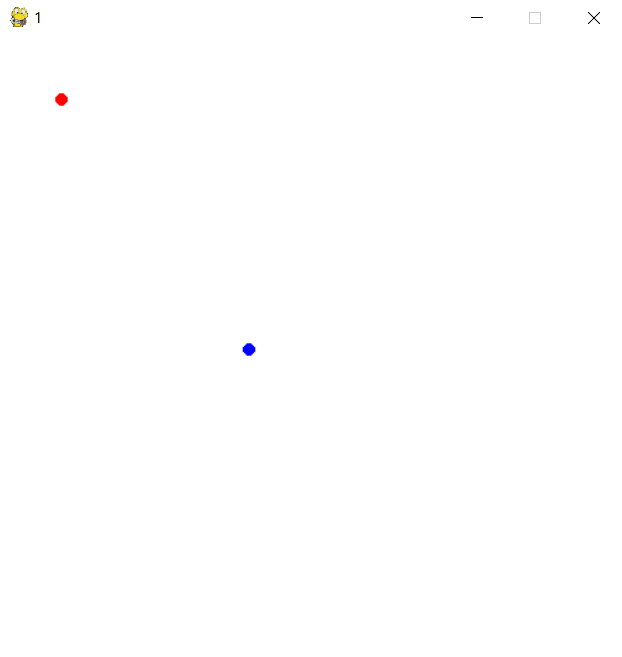

**2.**
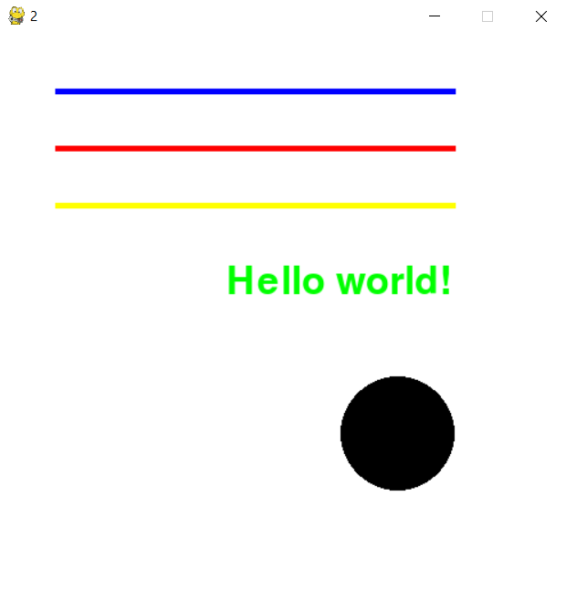

**3.**
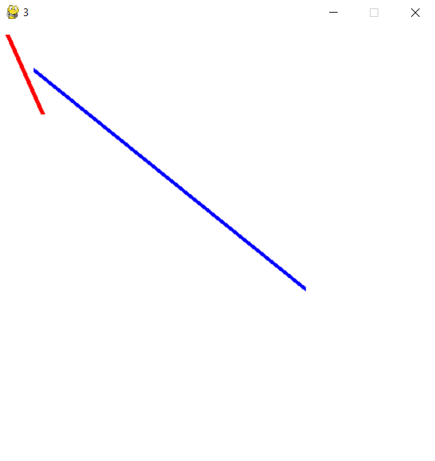

**4.**
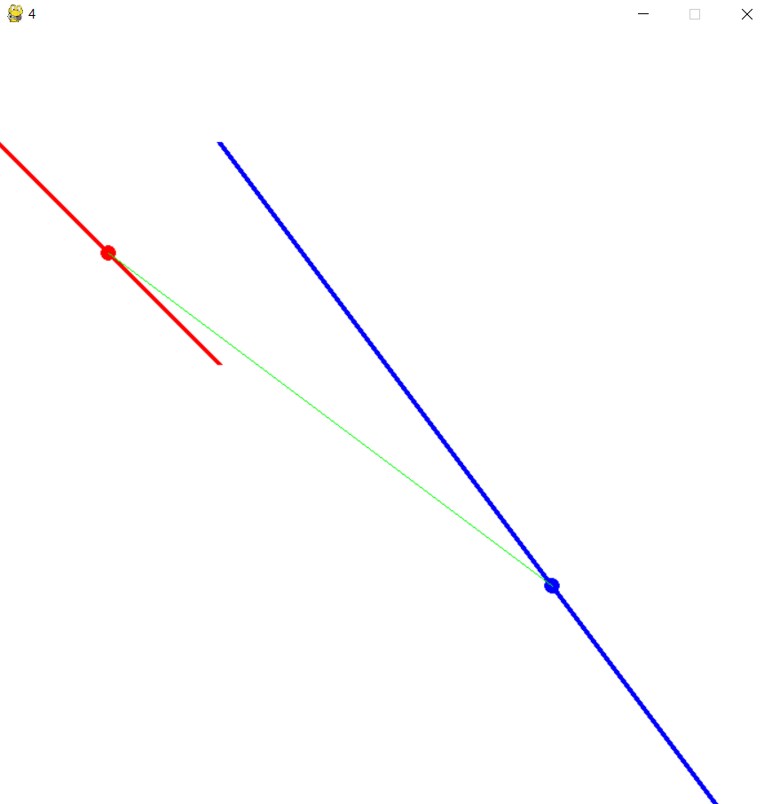

**5.**
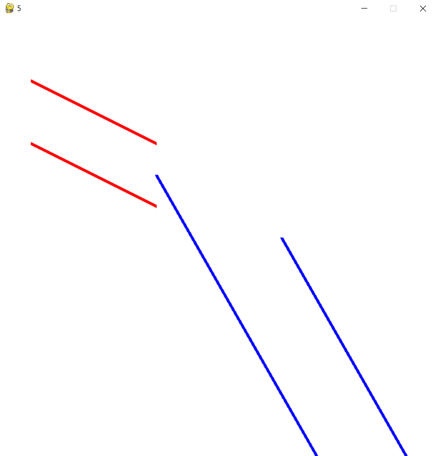

**6.**
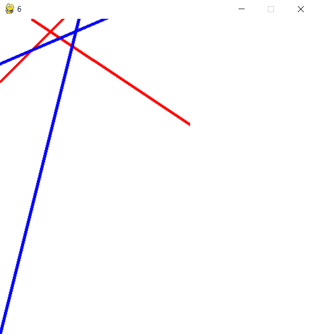

**7.**
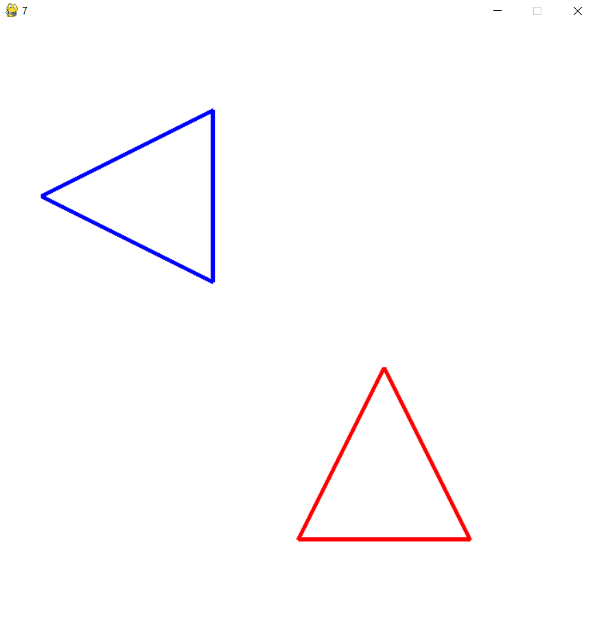

**8.**
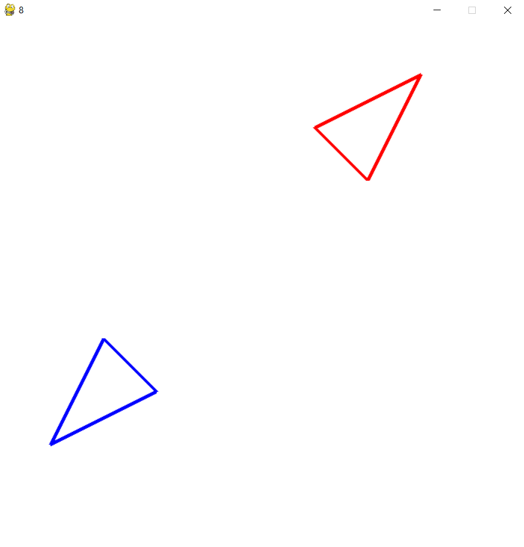

**9.**
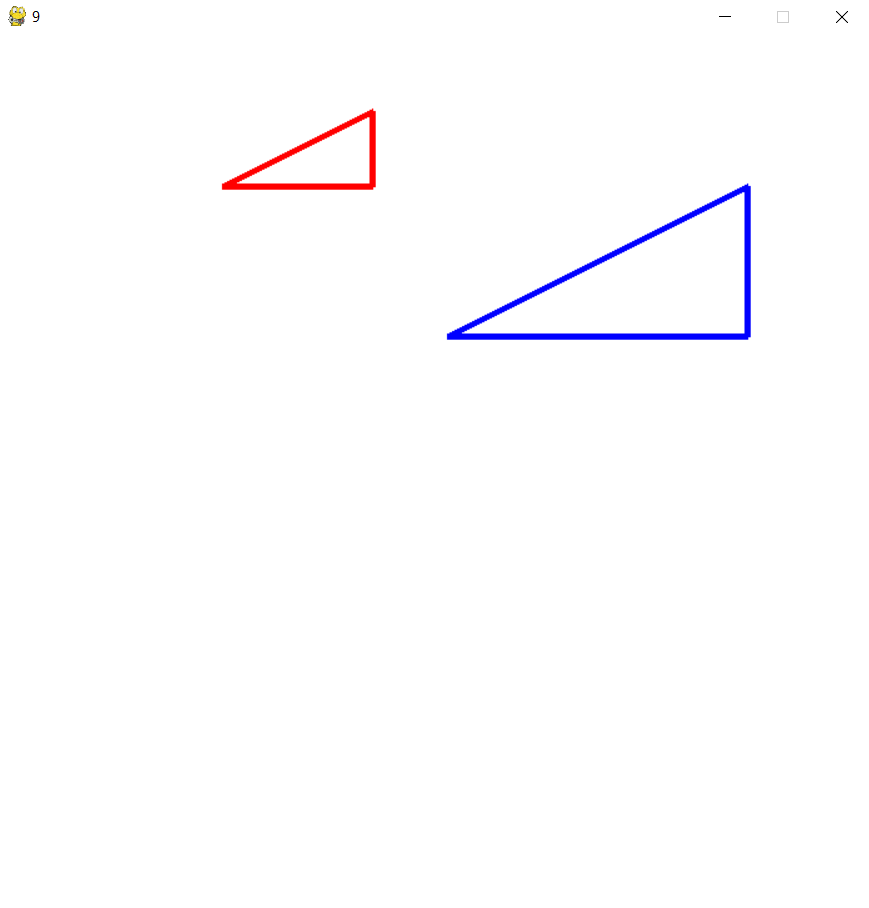

**10.**
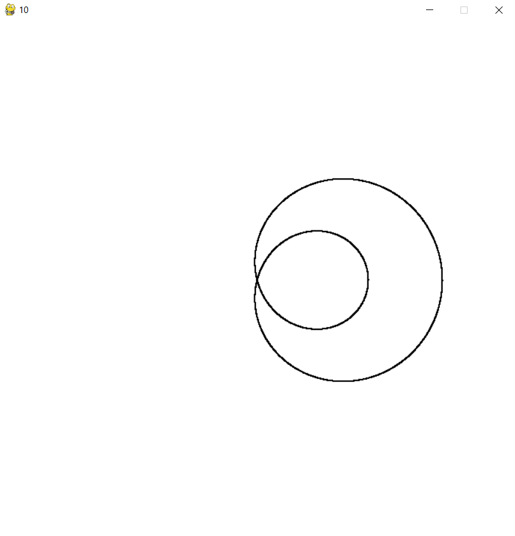

**11.**
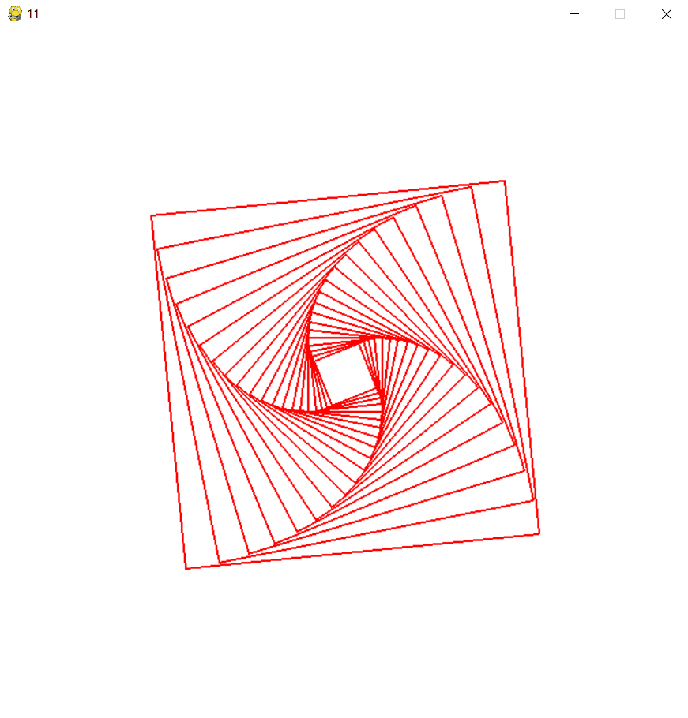
