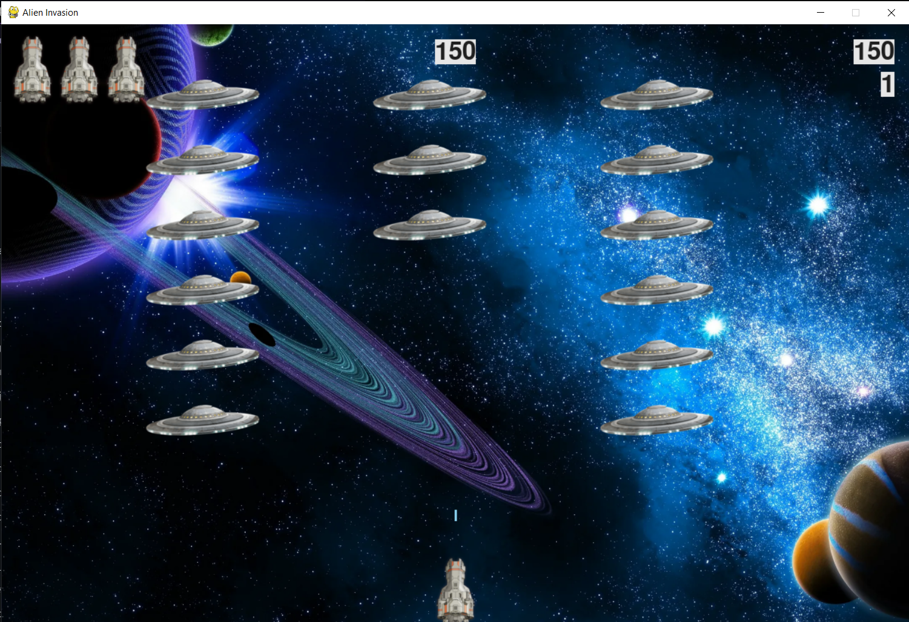

# Щеткин Дмитрий ИВТ 2.1
# Математические основы компьютерной графики ПР 2. Базовая 2D-игра «Инопланетное вторжение» с использованием Pygame

### Цель работы:
Разработать игру «Инопланетное вторжение», в которой игрок управляет кораблём и должен уничтожить флот инопланетян. Работа позволит вам познакомиться с основами разработки игр на Python с помощью библиотеки pygame и
позволит применить эти знания о компьютерной графике, анимации и управлении событиями в дальнейшем.

### Результат работы:

### Задания:
1. **Настройка окружения:**
    - Окружение настроено, pygame установлена.
2. **Создание игрового окна:**
    - Создано игровое окно с размерами 1200х800 пикселей, на фон установлено кастомное изображение.
3. **Разработка основного цикла игры:**
    - Реализован главный цикл while. В цикле обрабатываются события (движение корабля, выстрелы) и обновляется экран.
4. **Создание класса Ship (Корабль):**
    - Создан класс `Ship`. 
    - Задана стартовая позиция корабля, реализовано его движение вправо и влево, управляя координатами. Позиционирование корабля соответствует центру нижней границы экрана.
5. **Добавление стрельбы:**
    - Создан класс `Bullet`, который создаёт снаряды и контролирует их движение вверх. Снаряды удаляются, если они выходят за верхнюю границу экрана.
    - Включена функциональность для стрельбы при нажатии пробела. Снаряды появляются перед кораблём и двигаются вверх.
6. **Создание флота инопланетян:**
    - Разработан класс `Alien` для создания инопланетян.
    - Сформировано несколько рядов инопланетян, которые движутся горизонтально, меняют направление при
    достижении края экрана и постепенно опускаются вниз.
    - Обновляется положение каждого инопланетянина в зависимости от текущего состояния игры.
7. **Добавление конца игры и ограничения:**
    - Добавлена система жизней для игрока: при столкновении с инопланетянином или достижении нижней границы игрок теряет корабль. Игра завершается, если игрок теряет все корабли.
    - Реализовано увеличение скорости и сложности игры с каждым уровнем.
8. **Организация структуры кода:**
    - Код разделен на модули: 
        - `alien_invasion.py` — главный файл
        - `settings.py` — файл для настроек
        - `ship.py` — файл для корабля
        - `alien.py` — файл для инопланетянина
        - `bullet.py` — файл для стрельбы
        - `button.py` — файл для кнопки Play
        - `game_stats.py` — файл для статистики
        - `scoreboard.py` — файл для подсчета очков

9. **Дополнительные задания для расширения функционала:**
    - Добавлена таблица рекордов, которая сохраняет лучший результат `high_score`.
    - Реализована система уровней `level` и начисление очков за каждого уничтоженного инопланетянина `alien_points`.