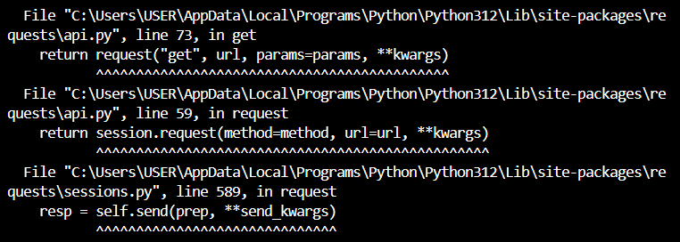
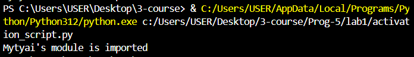

# Щеткин Дмитрий ИВТ 2.1
# Прог-5 Лабораторная работа 1. Реализация удаленного импорта

Создаем файл с функцией [myremotemodule.py](lab1/rootserver/myremotemodule.py) в папке rootserver

Создаем файл [activation_script.py](lab1/activation_script.py)

При попытке выполнить код без сервере возникает ошибка:


Запускаем сервер с помощью команды:
```text
python -m http.server
```


При попытке выполнить код с сервером успешно импортируем модуль:



