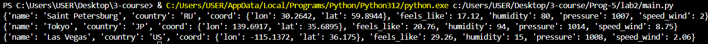
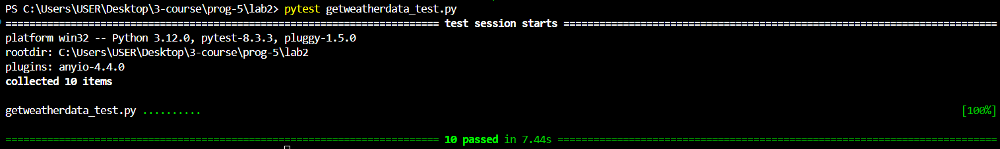

# Щеткин Дмитрий ИВТ 2.1
# Прог-5 Лабораторная работа 2. Использование API openweathermap.org

Создаем файл [main.py](main.py)

Создаем файл [getweatherdata.py](getweatherdata.py) с функцией get_weather_data

Создаем файл [owm_key.py](owm_key.py), где вводим свой ключ с сайта [https://home.openweathermap.org/api_keys](https://home.openweathermap.org/api_keys)

При запуске main.py получаем:

### Тесты

Файл [getweatherdata_test.py](getweatherdata_test.py) для тестов

При вводе `pytest getweatherdata_test.py` получаем:
