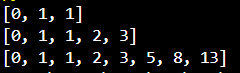
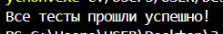
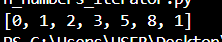

# Щеткин Дмитрий ИВТ 2.1
# Прог-5 Лабораторная работа 4. Создание генератора с элементами ряда Фибоначчи

# Задание 1

Создаем файл с сопгромраммой, реализующей возвращение списка элементов ряда Фибоначчи [gen_fib.py](1/gen_fib.py)

При попытке выполнить файл [gen_fib.py](1/gen_fib.py) получаем:

Создаем файл с тестами [test_fib.py](1/test_fib.py)

При попытке выполнить файл [test_fib.py](1/test_fib.py) получаем:

# Задание 2

Создаем файл с классом FibonacchiLst [even_numbers_iterator.py](2/even_numbers_iterator.py)

При попытке выполнить файл [even_numbers_iterator.py](2/even_numbers_iterator.py) с `lst = [0, 1, 2, 3, 4, 5, 6, 7, 8, 9, 1]` получаем:

