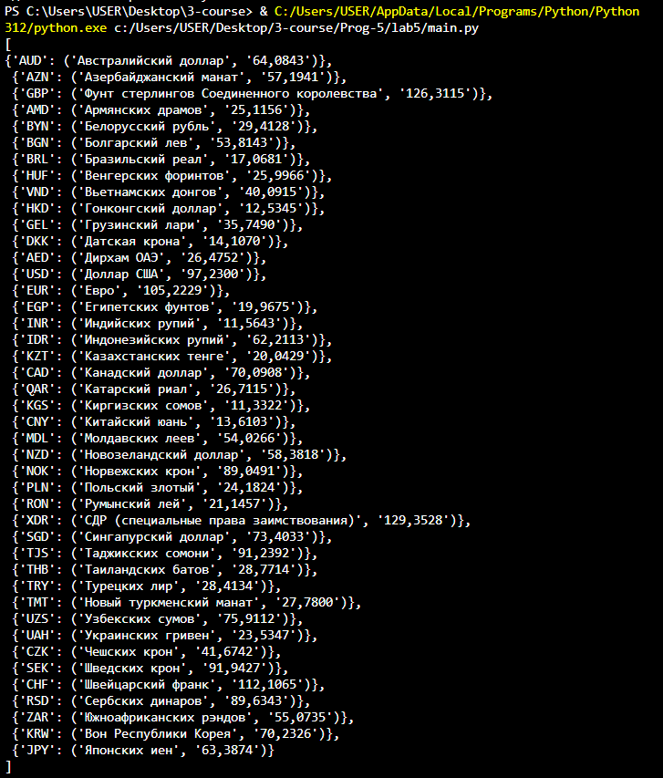
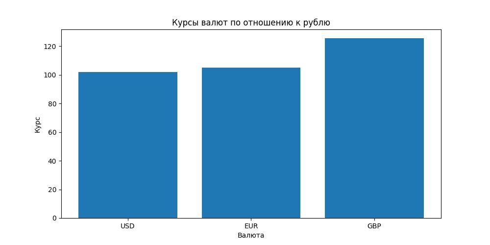
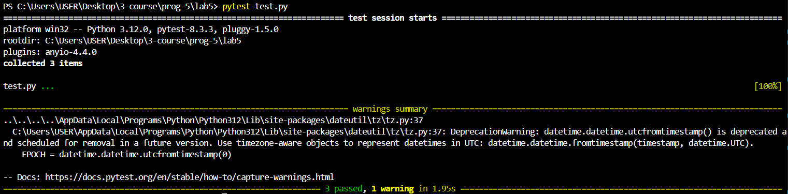

# Щеткин Дмитрий ИВТ 2.1
# Прог-5 Лабораторная работа 5. Получение курсов валют (ООП)

Файл с кодом [main.py](main.py)

Выполненные требования:

1. Создан класс CurrencyRates реализует методы для получения валюты (get_currency), геттеры и сеттеры.

2. Значения валюты хранятся в виде кортежа с целой и дробной частью: ('value_int', 'value_frac').

3. Метод get_all_currencies возвращает список словарей с валютами в заданном формате.

4. Номинал валюты сохраняется в словаре self._currencies как отдельный элемент, что позволяет убрать путаницу с переводом в рубли.

5. Метод _can_fetch проверяет, прошло ли достаточно времени с последнего запроса.

6. Написаны тесты в файле [test.py](test.py), подробнее написано ниже.

7. Метод visualize_currencies генерирует график и сохраняет его в файл [currencies.jpg](currencies.jpg) в той же директории, где находится код.

При выполнении кода получаем:

### Тесты

Файл [test.py](test.py) для тестов:

- проверка по неправильному коду возвращается словарь с неправильным id и значением None: {'R9999': None}
- проверка названия валюты (русскоязычное)
- проверка диапазона значений от 0 до 999

При вводе `pytest test.py` получаем:

