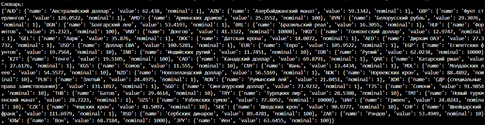
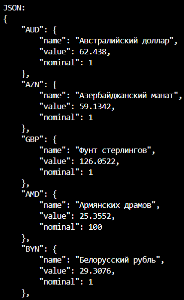
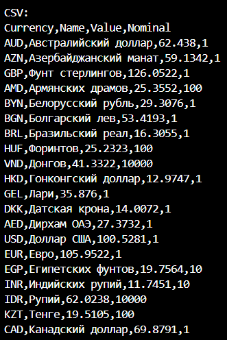

# Щеткин Дмитрий ИВТ 2.1
# Прог-5 Лабораторная работа 6. Использование шаблона «Декоратор»

# Цель работы
Примените паттерн декоратор и реализуйте объектно-ориентированную версию программы получения курсов валют с сайта Центробанка таким образом, чтобы:

 - было возможно использовать базовую версию для получения информации о валютах (возвращает словарь со структурой, описанной в одной из предыдущих лабораторных работ) (class CurrenciesList);
 
 - было возможно применить декоратор к базовой версии и получить данные в формате JSON (class ConcreteDecoratorJSON);
 
 - было возможно использовать декоратор к базовой версии (CurrenciesList) или к другому декоратору (ConcreteDecoratorJSON) и получить данные в формате csv (class ConcreteDecoratorCSV).
 
