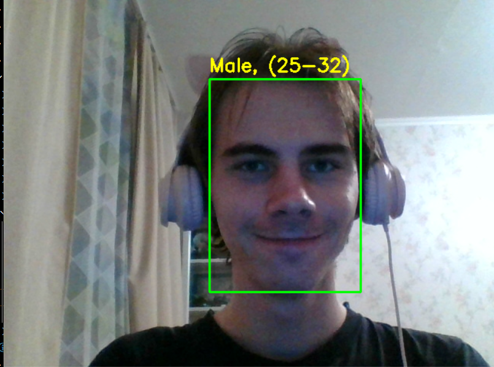
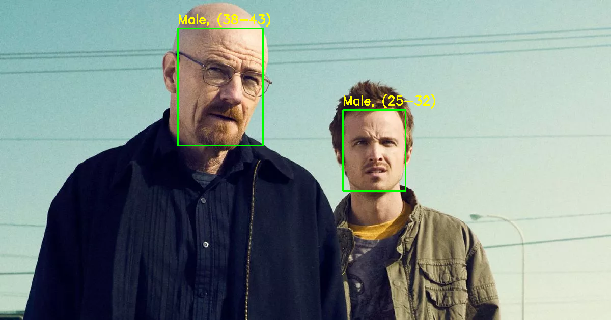

# Лабораторная работа 8
# Распознавание лиц на изображении с веб-камеры
## Щеткин Д.С. ИВТ 2.1

### Отчет по работе

1. Функция ```highlightFace()``` для определения координат лиц и отображения прямоугольника

2. Функция ```predict_age_gender()``` для предсказания пола и возраста

3. Реализовано меню для выбора режима: обработка изображения из файла или обработка в реальном времени с камеры

### Результат для кадра видео с камеры:



### Результат для загруженного изображения:

